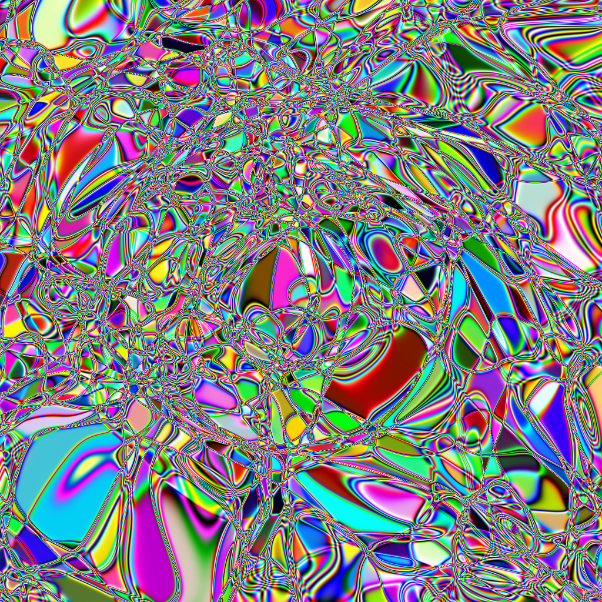

# CPPN 
Compositional Pattern Producing Network Implemented in Python3 with PyTorch 0.4.0

This should work **out of the box** with just a couple packages:

* PyTorch 0.4.0
* Scipy
* Numpy

This really has to be played with to get the full extent of the possibilities here. 

If you're here at all then I assume you know what you want. 

Knobs to tune:
* latent **z** distribution (uniform/normal/multimodal)
* scaling factor on **z**
* number of FC layers for complexity
* number of units per FC layer for complexity
* output resolution
* channels in output (1 for bw, 3 for rgb)

I don't remember how to make these, just play around. 

If you have PyTorch 0.4.1+, there is a weird bug/feature with the mean() function creating a 1-dim tensor that gets broadcasted to 0-dim. To avoid it just replace instances of `.mean()` with `.mean(0, keepdim=True)`
